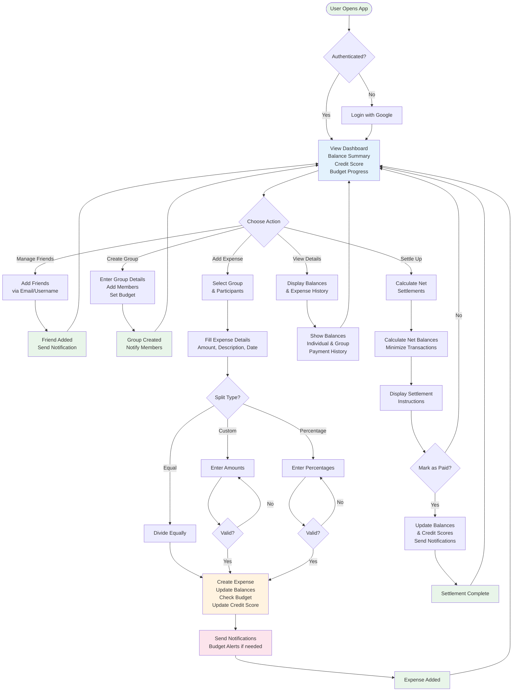

```mermaid
flowchart TD
    Start([User Opens App]) --> Auth{Authenticated?}
    
    Auth -->|No| Login[Login with Google]
    Auth -->|Yes| Dashboard[View Dashboard<br/>Balance Summary<br/>Credit Score<br/>Budget Progress]
    Login --> Dashboard
    
    Dashboard --> Action{Choose Action}
    
    Action -->|Manage Friends| Friends[Add Friends<br/>via Email/Username]
    Action -->|Create Group| CreateGroup[Enter Group Details<br/>Add Members<br/>Set Budget]
    Action -->|Add Expense| SelectGroup[Select Group<br/>& Participants]
    Action -->|View Details| ViewBalance[Display Balances<br/>& Expense History]
    Action -->|Settle Up| Settlement[Calculate Net<br/>Settlements]
    
    Friends --> FriendAdded[Friend Added<br/>Send Notification]
    
    CreateGroup --> GroupCreated[Group Created<br/>Notify Members]
    
    SelectGroup --> ExpenseForm[Fill Expense Details<br/>Amount, Description, Date]
    ExpenseForm --> SplitType{Split Type?}
    SplitType -->|Equal| EqualSplit[Divide Equally]
    SplitType -->|Custom| CustomSplit[Enter Amounts]
    SplitType -->|Percentage| PercentSplit[Enter Percentages]
    
    EqualSplit --> ProcessExpense[Create Expense<br/>Update Balances<br/>Check Budget<br/>Update Credit Score]
    CustomSplit --> ValidateAmounts{Valid?}
    PercentSplit --> ValidatePercent{Valid?}
    
    ValidateAmounts -->|No| CustomSplit
    ValidateAmounts -->|Yes| ProcessExpense
    ValidatePercent -->|No| PercentSplit
    ValidatePercent -->|Yes| ProcessExpense
    
    ProcessExpense --> NotifyMembers[Send Notifications<br/>Budget Alerts if needed]
    NotifyMembers --> ExpenseAdded[Expense Added]
    
    ViewBalance --> DisplayDetails[Show Balances<br/>Individual & Group<br/>Payment History]
    
    Settlement --> CalculateNet[Calculate Net Balances<br/>Minimize Transactions]
    CalculateNet --> ShowSettlements[Display Settlement<br/>Instructions]
    ShowSettlements --> MarkPaid{Mark as Paid?}
    MarkPaid -->|Yes| UpdateBalances[Update Balances<br/>& Credit Scores<br/>Send Notifications]
    MarkPaid -->|No| Dashboard
    UpdateBalances --> SettlementComplete[Settlement Complete]
    
    FriendAdded --> Dashboard
    GroupCreated --> Dashboard
    ExpenseAdded --> Dashboard
    DisplayDetails --> Dashboard
    SettlementComplete --> Dashboard
    
    style Start fill:#e8f5e9
    style Dashboard fill:#e3f2fd
    style ProcessExpense fill:#fff3e0
    style NotifyMembers fill:#fce4ec
    style FriendAdded fill:#e8f5e9
    style GroupCreated fill:#e8f5e9
    style ExpenseAdded fill:#e8f5e9
    style SettlementComplete fill:#e8f5e9
```
