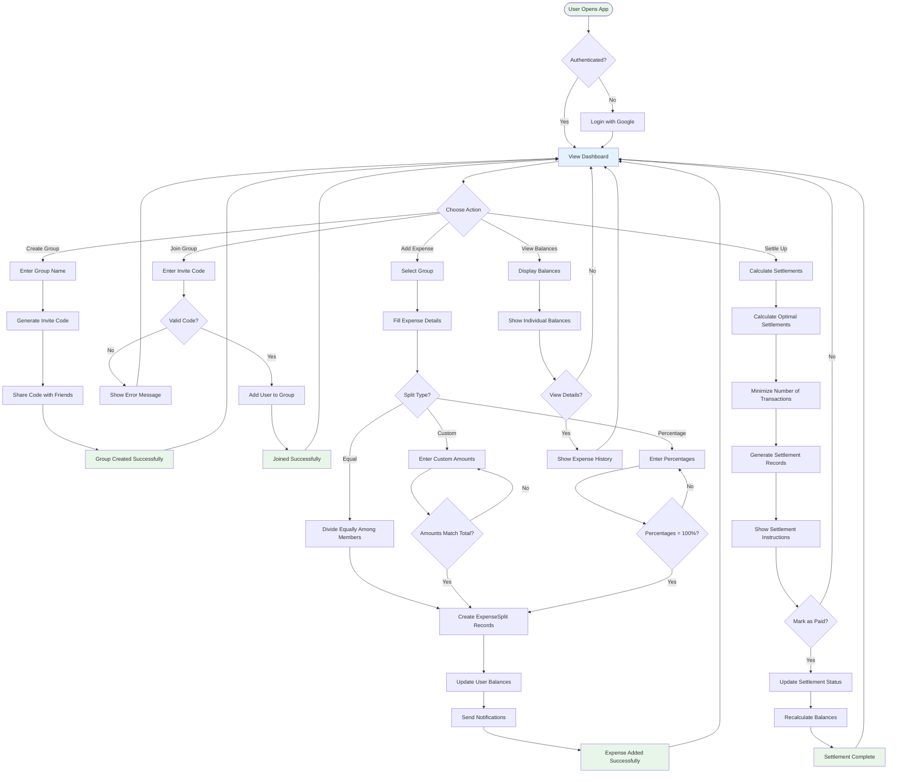

```mermaid
flowchart TD
    Start([User Opens App]) --> Auth{Authenticated?}
    
    Auth -->|No| Login[Login with Google]
    Auth -->|Yes| Dashboard[View Dashboard]
    Login --> Dashboard
    
    Dashboard --> Action{Choose Action}
    
    Action -->|Create Group| CreateGroup[Enter Group Name]
    Action -->|Join Group| JoinGroup[Enter Invite Code]
    Action -->|Add Expense| SelectGroup[Select Group]
    Action -->|View Balances| ViewBalance[Display Balances]
    Action -->|Settle Up| Settlement[Calculate Settlements]
    
    CreateGroup --> GenerateCode[Generate Invite Code]
    GenerateCode --> ShareCode[Share Code with Friends]
    ShareCode --> GroupCreated[Group Created Successfully]
    
    JoinGroup --> ValidateCode{Valid Code?}
    ValidateCode -->|No| ErrorJoin[Show Error Message]
    ValidateCode -->|Yes| AddMember[Add User to Group]
    AddMember --> GroupJoined[Joined Successfully]
    ErrorJoin --> Dashboard
    
    SelectGroup --> ExpenseForm[Fill Expense Details]
    ExpenseForm --> SplitType{Split Type?}
    SplitType -->|Equal| EqualSplit[Divide Equally Among Members]
    SplitType -->|Custom| CustomSplit[Enter Custom Amounts]
    SplitType -->|Percentage| PercentSplit[Enter Percentages]
    
    EqualSplit --> CreateSplits[Create ExpenseSplit Records]
    CustomSplit --> ValidateAmounts{Amounts Match Total?}
    PercentSplit --> ValidatePercent{Percentages = 100%?}
    
    ValidateAmounts -->|No| CustomSplit
    ValidateAmounts -->|Yes| CreateSplits
    ValidatePercent -->|No| PercentSplit
    ValidatePercent -->|Yes| CreateSplits
    
    CreateSplits --> UpdateBalances[Update User Balances]
    UpdateBalances --> NotifyMembers[Send Notifications]
    NotifyMembers --> ExpenseAdded[Expense Added Successfully]
    
    ViewBalance --> DisplayBalances[Show Individual Balances]
    DisplayBalances --> BalanceDetails{View Details?}
    BalanceDetails -->|Yes| ExpenseHistory[Show Expense History]
    BalanceDetails -->|No| Dashboard
    
    Settlement --> CalculateOptimal[Calculate Optimal Settlements]
    CalculateOptimal --> MinimizeTransactions[Minimize Number of Transactions]
    MinimizeTransactions --> GenerateSettlements[Generate Settlement Records]
    GenerateSettlements --> DisplaySettlements[Show Settlement Instructions]
    DisplaySettlements --> MarkPaid{Mark as Paid?}
    MarkPaid -->|Yes| UpdateSettlement[Update Settlement Status]
    MarkPaid -->|No| Dashboard
    UpdateSettlement --> RecalculateBalances[Recalculate Balances]
    RecalculateBalances --> SettlementComplete[Settlement Complete]
    
    GroupCreated --> Dashboard
    GroupJoined --> Dashboard
    ExpenseAdded --> Dashboard
    ExpenseHistory --> Dashboard
    SettlementComplete --> Dashboard
    
    style Start fill:#e8f5e9
    style Dashboard fill:#e3f2fd
    style GroupCreated fill:#e8f5e9
    style GroupJoined fill:#e8f5e9
    style ExpenseAdded fill:#e8f5e9
    style SettlementComplete fill:#e8f5e9
```