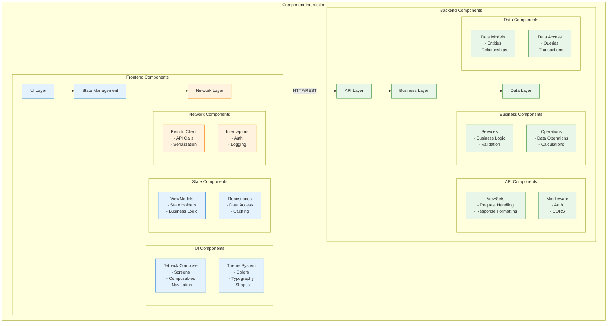

```mermaid
flowchart TB
    subgraph "Component Interaction"
        subgraph "Frontend Components"
            direction TB
            UI["UI Layer"]
            State["State Management"]
            Network["Network Layer"]

            subgraph "UI Components"
                Compose["Jetpack Compose<br/>- Screens<br/>- Composables<br/>- Navigation"]
                Theme["Theme System<br/>- Colors<br/>- Typography<br/>- Shapes"]
            end

            subgraph "State Components"
                ViewModel["ViewModels<br/>- State Holders<br/>- Business Logic"]
                Repository["Repositories<br/>- Data Access<br/>- Caching"]
            end

            subgraph "Network Components"
                Retrofit["Retrofit Client<br/>- API Calls<br/>- Serialization"]
                Interceptor["Interceptors<br/>- Auth<br/>- Logging"]
            end
        end

        subgraph "Backend Components"
            direction TB
            API["API Layer"]
            Business["Business Layer"]
            Data["Data Layer"]

            subgraph "API Components"
                Views["ViewSets<br/>- Request Handling<br/>- Response Formatting"]
                Middleware["Middleware<br/>- Auth<br/>- CORS"]
            end

            subgraph "Business Components"
                Services["Services<br/>- Business Logic<br/>- Validation"]
                Operations["Operations<br/>- Data Operations<br/>- Calculations"]
            end

            subgraph "Data Components"
                Models["Data Models<br/>- Entities<br/>- Relationships"]
                DAL["Data Access<br/>- Queries<br/>- Transactions"]
            end
        end

        UI --> State
        State --> Network
        Network -->|"HTTP/REST"| API
        API --> Business
        Business --> Data
    end

    classDef frontend fill:#e3f2fd,stroke:#1976d2,color:#333
    classDef backend fill:#e8f5e9,stroke:#388e3c,color:#333
    classDef network fill:#fff3e0,stroke:#f57c00,color:#333

    class UI,State,Compose,Theme,ViewModel,Repository frontend
    class API,Business,Data,Views,Middleware,Services,Operations,Models,DAL backend
    class Network,Retrofit,Interceptor network
```
