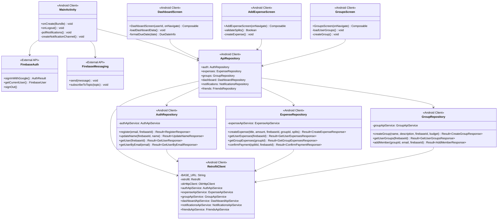

# Design Diagrams

## 1. Android Client Design Diagram

```mermaid
classDiagram
    %% External APIs
    class FirebaseAuth {
        <<External API>>
        +signInWithGoogle() AuthResult
        +getCurrentUser() FirebaseUser
        +signOut()
    }

    class FirebaseMessaging {
        <<External API>>
        +send(message) void
        +subscribeToTopic(topic) void
    }

    %% ==== ANDROID CLIENT CLASSES ====

    class MainActivity {
        <<Android Client>>
        +onCreate(Bundle) void
        +onLogout() void
        -pollNotifications() void
        -createNotificationChannel() void
    }

    class DashboardScreen {
        <<Android Client>>
        +DashboardScreen(userId, onNavigate) Composable
        -loadDashboardData() void
        -formatDueDate(date) DueDateInfo
    }

    class AddExpenseScreen {
        <<Android Client>>
        +AddExpenseScreen(onNavigate) Composable
        -validateSplits() Boolean
        -createExpense() void
    }

    class GroupsScreen {
        <<Android Client>>
        +GroupsScreen(onNavigate) Composable
        -loadUserGroups() void
        -createGroup() void
    }

    %% API Layer (Android Client)
    class ApiRepository {
        <<Android Client>>
        +auth: AuthRepository
        +expenses: ExpenseRepository
        +groups: GroupRepository
        +dashboard: DashboardRepository
        +notifications: NotificationsRepository
        +friends: FriendsRepository
    }

    class RetrofitClient {
        <<Android Client>>
        -BASE_URL: String
        -retrofit: Retrofit
        -okHttpClient: OkHttpClient
        +authApiService: AuthApiService
        +expenseApiService: ExpenseApiService
        +groupApiService: GroupApiService
        +dashboardApiService: DashboardApiService
        +notificationsApiService: NotificationsApiService
        +friendsApiService: FriendsApiService
    }

    class AuthRepository {
        <<Android Client>>
        -authApiService: AuthApiService
        +register(email, firebaseId) Result~RegisterResponse~
        +updateName(firebaseId, name) Result~UpdateNameResponse~
        +getUser(firebaseId) Result~GetUserResponse~
        +getUserByEmail(email) Result~GetUserByEmailResponse~
    }

    class ExpenseRepository {
        <<Android Client>>
        -expenseApiService: ExpenseApiService
        +createExpense(title, amount, firebaseId, groupId, splits) Result~CreateExpenseResponse~
        +getUserExpenses(firebaseId) Result~GetUserExpensesResponse~
        +getGroupExpenses(groupId) Result~GetGroupExpensesResponse~
        +confirmPayment(splitId, firebaseId) Result~ConfirmPaymentResponse~
    }

    class GroupRepository {
        <<Android Client>>
        -groupApiService: GroupApiService
        +createGroup(name, description, firebaseId, budget) Result~CreateGroupResponse~
        +getUserGroups(firebaseId) Result~GetUserGroupsResponse~
        +addMember(groupId, email, firebaseId) Result~AddMemberResponse~
    }

    %% Android Client Relationships
    MainActivity --> ApiRepository
    DashboardScreen --> ApiRepository
    AddExpenseScreen --> ApiRepository
    GroupsScreen --> ApiRepository

    ApiRepository --> AuthRepository
    ApiRepository --> ExpenseRepository
    ApiRepository --> GroupRepository
    ApiRepository --> RetrofitClient

    AuthRepository --> RetrofitClient
    ExpenseRepository --> RetrofitClient
    GroupRepository --> RetrofitClient

    MainActivity --> FirebaseAuth
    MainActivity --> FirebaseMessaging
```

## 2. Django Backend Design Diagram

```mermaid
classDiagram
    %% External APIs

    class SupabaseDB {
        <<External Database>>
        +query(sql) ResultSet
        +insert(table, data) Record
        +update(table, data, filters) Record
    }

    %% ==== DJANGO SERVER CLASSES ====

    class AuthView {
        <<Django Server>>
        +register(request) Response
        +update_name(request) Response
        +get_user(request) Response
        +get_user_by_email(request) Response
    }

    class ExpensesView {
        <<Django Server>>
        +create_expense(request) Response
        +get_user_expenses(request) Response
        +get_group_expenses(request) Response
        +delete_expense(request, pk) Response
        +add_split(request, pk) Response
        +confirm_payment(request, pk) Response
        +request_payment(request, pk) Response
    }

    class GroupsView {
        <<Django Server>>
        +create_group(request) Response
        +get_user_groups(request) Response
        +add_member(request, pk) Response
        +get_group_members(request, pk) Response
        +update_budget(request, pk) Response
    }

    class DashboardView {
        <<Django Server>>
        +get_user_expenses(request) Response
        +get_lent_expenses(request) Response
        +get_owed_splits(request) Response
    }

    class NotificationsView {
        <<Django Server>>
        +get_all_notifications(request) Response
        +update_notification_processed(request) Response
    }

    class FriendRequestView {
        <<Django Server>>
        +send_friend_request(request) Response
        +get_friend_requests(request) Response
        +accept_friend_request(request, pk) Response
        +get_friends(request) Response
    }

    %% Data Access Layer (Django Server)
    class SupabaseClient {
        <<Django Server>>
        -_instance: SupabaseClient
        -base_client: BaseSupabaseClient
        +users: UserOperations
        +expenses: ExpenseOperations
        +groups: GroupOperations
        +notifications: NotificationOperations
        +friend_requests: FriendRequestOperations
        +test_connection() bool
        +close_connection() void
    }

    class BaseSupabaseClient {
        <<Django Server>>
        -client: Client
        -environment: String
        -table_prefix: String
        +get_table_name(base_name) String
        +_execute_query(table, operation, data, filters) Any
        +test_connection() bool
        +close_connection() void
    }

    class UserOperations {
        <<Django Server>>
        -client: BaseSupabaseClient
        -table_name: String
        +get_by_email(email) Optional~Dict~
        +get_by_firebase_id(firebase_id) Optional~Dict~
        +get_by_id(user_id) Optional~Dict~
        +create(email, firebase_id) Optional~Dict~
        +update_name(firebase_id, name) Optional~Dict~
        +search_by_username(username) List~Dict~
    }

    class ExpenseOperations {
        <<Django Server>>
        -client: BaseSupabaseClient
        -expenses_table: String
        -splits_table: String
        +create_expense(title, amount, created_by, group_id) Optional~Dict~
        +create_split(expense_id, user_id, amount) Optional~Dict~
        +get_user_lent_expenses(user_id) Optional~List~
        +get_user_owed_splits(user_id) Optional~List~
        +get_user_dashboard_data(user_id) Dict
        +confirm_payment(split_id, confirming_user_id) Optional~Dict~
        +request_payment(split_id) Optional~Dict~
        +update_group_budget_after_expense(group_id, amount) bool
    }

    class GroupOperations {
        <<Django Server>>
        -client: BaseSupabaseClient
        -groups_table: String
        -memberships_table: String
        +create_group(name, description, created_by, budget) Optional~Dict~
        +get_user_groups(user_id) Optional~List~
        +add_member(group_id, user_id) Optional~Dict~
        +get_group_members(group_id) Optional~List~
        +update_budget(group_id, budget) Optional~Dict~
    }

    class CreditScoreOperations {
        <<Django Server>>
        -client: BaseSupabaseClient
        +calculate_user_credit_score(user_id) Optional~int~
        +update_user_credit_score(user_id) Optional~Dict~
        +get_user_credit_score(user_id) Optional~Dict~
        -_calculate_payment_history_score(splits) float
        -_calculate_payment_behavior_score(splits) float
        -_calculate_debt_utilization_score(splits) float
        -_calculate_payment_patterns_score(splits) float
    }

    class NotificationOperations {
        <<Django Server>>
        -client: BaseSupabaseClient
        -table_name: String
        +create_notification(user_id, message, type) Optional~Dict~
        +get_all_unprocessed_notifications(firebase_id) Optional~List~
        +update_notification_processed(notification_id) Optional~Dict~
    }


    %% Django Server Relationships
    AuthView --> SupabaseClient
    ExpensesView --> SupabaseClient
    ExpensesView --> CreditScoreOperations
    GroupsView --> SupabaseClient
    DashboardView --> SupabaseClient
    NotificationsView --> SupabaseClient
    FriendRequestView --> SupabaseClient

    SupabaseClient --> BaseSupabaseClient
    SupabaseClient --> UserOperations
    SupabaseClient --> ExpenseOperations
    SupabaseClient --> GroupOperations
    SupabaseClient --> NotificationOperations

    UserOperations --> BaseSupabaseClient
    ExpenseOperations --> BaseSupabaseClient
    GroupOperations --> BaseSupabaseClient
    CreditScoreOperations --> BaseSupabaseClient
    NotificationOperations --> BaseSupabaseClient

    BaseSupabaseClient --> SupabaseDB
```
