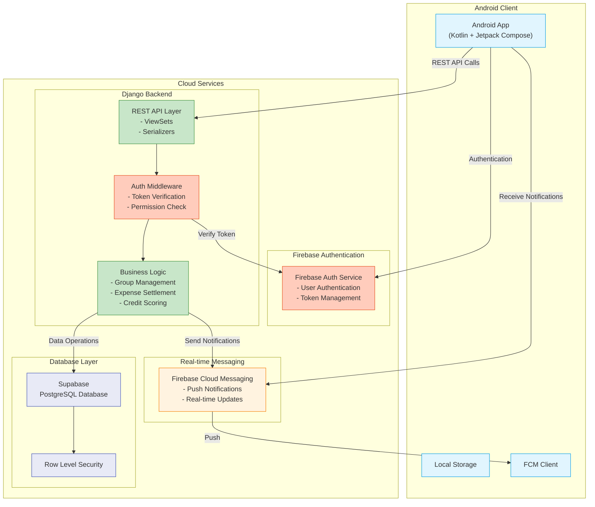
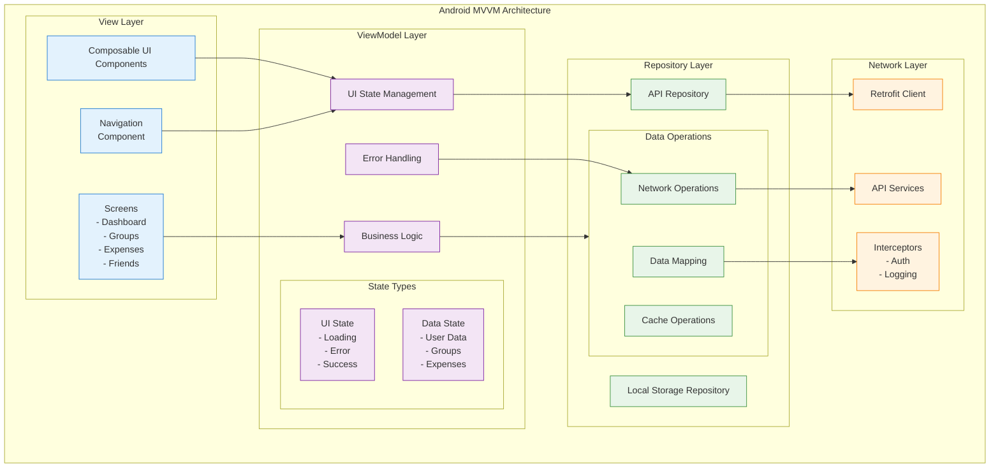

# Architectural Diagrams

## 1. System Architecture Diagram (Client-Server Overview)

```mermaid
flowchart TB
    subgraph Client["Android Client"]
        direction TB
        App["Android App<br/>(Kotlin + Jetpack Compose)"]
        LocalStore["Local Storage"]
        FCMClient["FCM Client"]
    end

    subgraph Cloud["Cloud Services"]
        direction TB
        subgraph Auth["Firebase Authentication"]
            FireAuth["Firebase Auth Service<br/>- User Authentication<br/>- Token Management"]
        end

        subgraph Backend["Django Backend"]
            API["REST API Layer<br/>- ViewSets<br/>- Serializers"]
            BL["Business Logic<br/>- Group Management<br/>- Expense Settlement<br/>- Credit Scoring"]
            AuthMW["Auth Middleware<br/>- Token Verification<br/>- Permission Check"]
        end

        subgraph DB["Database Layer"]
            Supabase["Supabase<br/>PostgreSQL Database"]
            RLS["Row Level Security"]
        end

        subgraph Messaging["Real-time Messaging"]
            FCM["Firebase Cloud Messaging<br/>- Push Notifications<br/>- Real-time Updates"]
        end
    end

    %% Client to Backend Communication
    App -->|"REST API Calls"| API
    App -->|"Authentication"| FireAuth
    App -->|"Receive Notifications"| FCM

    %% Backend Flow
    API --> AuthMW
    AuthMW -->|"Verify Token"| FireAuth
    AuthMW --> BL
    BL -->|"Data Operations"| Supabase
    Supabase --> RLS
    BL -->|"Send Notifications"| FCM
    FCM -->|"Push"| FCMClient

    classDef client fill:#e1f5fe,stroke:#039be5,color:#333
    classDef auth fill:#ffccbc,stroke:#e64a19,color:#333
    classDef backend fill:#c8e6c9,stroke:#388e3c,color:#333
    classDef database fill:#e8eaf6,stroke:#3f51b5,color:#333
    classDef messaging fill:#fff3e0,stroke:#f57c00,color:#333

    class App,LocalStore,FCMClient client
    class FireAuth,AuthMW auth
    class API,BL backend
    class Supabase,RLS database
    class FCM messaging
```

## 2. Android MVVM Layer Diagram

```mermaid
flowchart TB
    subgraph "Android MVVM Architecture"
        subgraph View["View Layer"]
            Composables["Composable UI Components"]
            Screens["Screens<br/>- Dashboard<br/>- Groups<br/>- Expenses<br/>- Friends"]
            Navigation["Navigation<br/>Component"]
        end

        subgraph ViewModel["ViewModel Layer"]
            State["UI State Management"]
            BusinessLogic["Business Logic"]
            ErrorHandling["Error Handling"]

            subgraph StateTypes["State Types"]
                UIState["UI State<br/>- Loading<br/>- Error<br/>- Success"]
                DataState["Data State<br/>- User Data<br/>- Groups<br/>- Expenses"]
            end
        end

        subgraph Repository["Repository Layer"]
            ApiRepo["API Repository"]
            LocalRepo["Local Storage Repository"]

            subgraph DataOps["Data Operations"]
                NetworkOps["Network Operations"]
                CacheOps["Cache Operations"]
                DataMapping["Data Mapping"]
            end
        end

        subgraph Network["Network Layer"]
            Retrofit["Retrofit Client"]
            ApiServices["API Services"]
            Interceptors["Interceptors<br/>- Auth<br/>- Logging"]
        end

        %% View to ViewModel
        Composables --> State
        Screens --> BusinessLogic
        Navigation --> State

        %% ViewModel to Repository
        State --> ApiRepo
        BusinessLogic --> DataOps
        ErrorHandling --> NetworkOps

        %% Repository to Network
        ApiRepo --> Retrofit
        NetworkOps --> ApiServices
        DataMapping --> Interceptors
    end

    classDef view fill:#e3f2fd,stroke:#1976d2,color:#333
    classDef viewmodel fill:#f3e5f5,stroke:#7b1fa2,color:#333
    classDef repository fill:#e8f5e9,stroke:#388e3c,color:#333
    classDef network fill:#fff3e0,stroke:#f57c00,color:#333

    class Composables,Screens,Navigation view
    class State,BusinessLogic,ErrorHandling,UIState,DataState viewmodel
    class ApiRepo,LocalRepo,NetworkOps,CacheOps,DataMapping repository
    class Retrofit,ApiServices,Interceptors network
```
