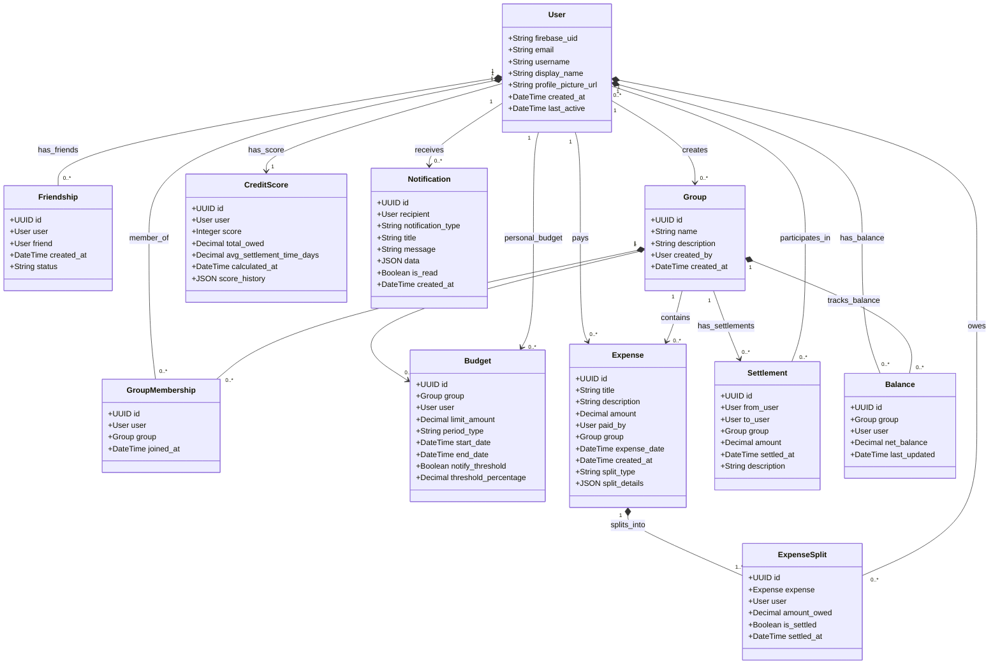

```mermaid
classDiagram
    class User {
        +String firebase_uid
        +String email
        +String username
        +String display_name
        +String profile_picture_url
        +DateTime created_at
        +DateTime last_active
    }
    
    class Friendship {
        +UUID id
        +User user
        +User friend
        +DateTime created_at
        +String status
    }
    
    class Group {
        +UUID id
        +String name
        +String description
        +User created_by
        +DateTime created_at
    }
    
    class GroupMembership {
        +UUID id
        +User user
        +Group group
        +DateTime joined_at
    }
    
    class Budget {
        +UUID id
        +Group group
        +User user
        +Decimal limit_amount
        +String period_type
        +DateTime start_date
        +DateTime end_date
        +Boolean notify_threshold
        +Decimal threshold_percentage
    }
    
    class Expense {
        +UUID id
        +String title
        +String description
        +Decimal amount
        +User paid_by
        +Group group
        +DateTime expense_date
        +DateTime created_at
        +String split_type
        +JSON split_details
    }
    
    class ExpenseSplit {
        +UUID id
        +Expense expense
        +User user
        +Decimal amount_owed
        +Boolean is_settled
        +DateTime settled_at
    }
    
    class Settlement {
        +UUID id
        +User from_user
        +User to_user
        +Group group
        +Decimal amount
        +DateTime settled_at
        +String description
    }
    
    class Balance {
        +UUID id
        +Group group
        +User user
        +Decimal net_balance
        +DateTime last_updated
    }
    
    class CreditScore {
        +UUID id
        +User user
        +Integer score
        +Decimal total_owed
        +Decimal avg_settlement_time_days
        +DateTime calculated_at
        +JSON score_history
    }
    
    class Notification {
        +UUID id
        +User recipient
        +String notification_type
        +String title
        +String message
        +JSON data
        +Boolean is_read
        +DateTime created_at
    }

    %% Relationships
    User "1" *-- "0..*" Friendship : has_friends
    User "1" *-- "0..*" GroupMembership : member_of
    Group "1" *-- "0..*" GroupMembership : contains
    User "1" --> "0..*" Group : creates
    User "1" --> "0..*" Expense : pays
    Group "1" --> "0..*" Expense : contains
    Group "1" --> "0..*" Budget : has_budget
    User "1" --> "0..*" Budget : personal_budget
    Expense "1" *-- "1..*" ExpenseSplit : splits_into
    User "1" *-- "0..*" ExpenseSplit : owes
    Group "1" --> "0..*" Settlement : has_settlements
    User "0..*" -- "0..*" Settlement : participates_in
    User "1" *-- "0..*" Balance : has_balance
    Group "1" *-- "0..*" Balance : tracks_balance
    User "1" --> "1" CreditScore : has_score
    User "1" --> "0..*" Notification : receives
```
