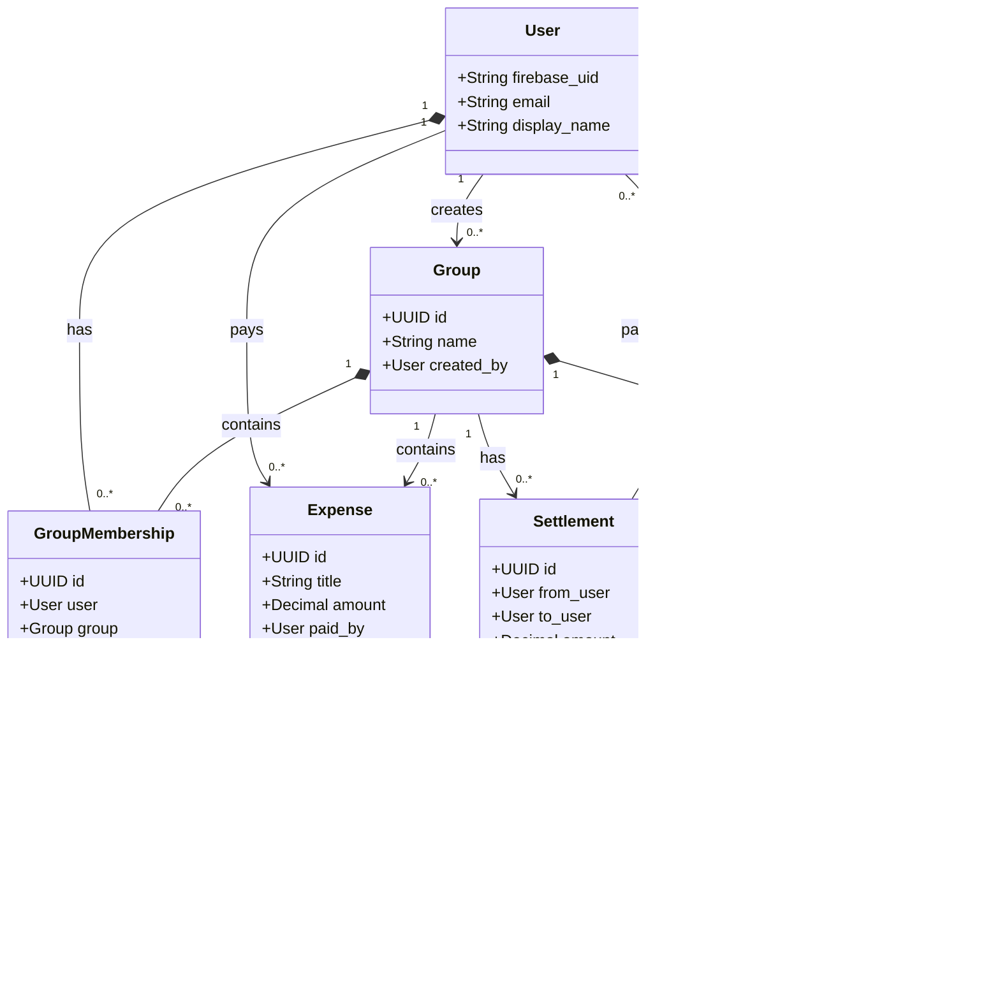

```mermaid
classDiagram
    class User {
        +String firebase_uid
        +String email
        +String display_name
    }

    class Group {
        +UUID id
        +String name
        +User created_by
    }

    class GroupMembership {
        +UUID id
        +User user
        +Group group
    }

    class Expense {
        +UUID id
        +String title
        +Decimal amount
        +User paid_by
        +Group group
    }

    class ExpenseSplit {
        +UUID id
        +Expense expense
        +User user
        +Decimal amount_owed
    }

    class Settlement {
        +UUID id
        +User from_user
        +User to_user
        +Decimal amount
    }

    class Balance {
        +UUID id
        +Group group
        +User user
        +Decimal net_balance
    }

    User "1" *-- "0..*" GroupMembership : has
    Group "1" *-- "0..*" GroupMembership : contains
    User "1" --> "0..*" Group : creates
    User "1" --> "0..*" Expense : pays
    Group "1" --> "0..*" Expense : contains
    Expense "1" *-- "1..*" ExpenseSplit : splits into
    User "1" *-- "0..*" ExpenseSplit : owes
    Group "1" --> "0..*" Settlement : has
    User "0..*" -- "0..*" Settlement : participates
    User "1" *-- "0..*" Balance : has
    Group "1" *-- "0..*" Balance : tracks
```