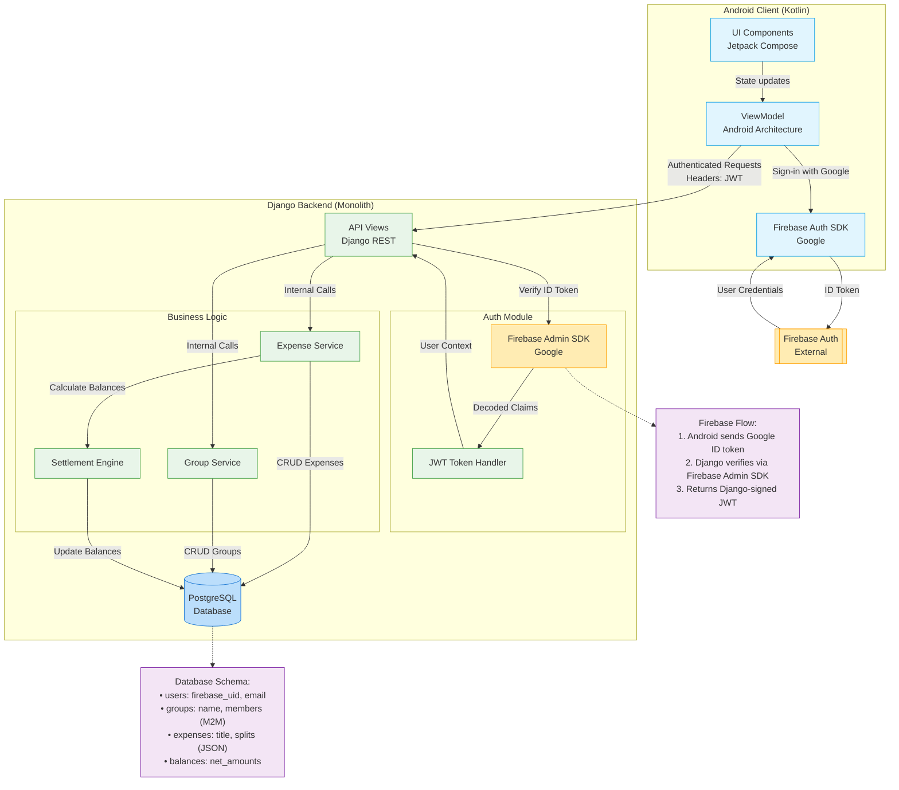

```mermaid
flowchart TB
    %% Styling
    classDef android fill:#e1f5fe,stroke:#039be5,color:#333
    classDef django fill:#e8f5e9,stroke:#43a047,color:#333
    classDef firebase fill:#ffecb3,stroke:#ffa000,color:#333
    classDef db fill:#bbdefb,stroke:#1976d2,color:#333
    classDef note fill:#f3e5f5,stroke:#7b1fa2,color:#333
    
    %% Android Client
    subgraph Android["Android Client (Kotlin)"]
        UI[UI Components<br/>Jetpack Compose]:::android
        VM[ViewModel<br/>Android Architecture]:::android
        FA[Firebase Auth SDK<br/>Google]:::android
    end
    
    %% Django Backend
    subgraph Django["Django Backend (Monolith)"]
        API[API Views<br/>Django REST]:::django
        
        subgraph Auth["Auth Module"]
            FASDK[Firebase Admin SDK<br/>Google]:::firebase
            JWT[JWT Token Handler]:::django
        end
        
        subgraph Logic["Business Logic"]
            Expense[Expense Service]:::django
            Group[Group Service]:::django
            Settle[Settlement Engine]:::django
        end
        
        DB[(PostgreSQL<br/>Database)]:::db
    end
    
    %% Firebase Auth (External)
    Firebase[[Firebase Auth<br/>External]]:::firebase
    
    %% Connections
    UI -->|State updates| VM
    VM -->|Sign-in with Google| FA
    FA -->|ID Token| Firebase
    Firebase -->|User Credentials| FA
    VM -->|Authenticated Requests<br/>Headers: JWT| API
    API -->|Verify ID Token| FASDK
    FASDK -->|Decoded Claims| JWT
    JWT -->|User Context| API
    API -->|Internal Calls| Expense
    API -->|Internal Calls| Group
    Expense -->|Calculate Balances| Settle
    Expense -->|CRUD Expenses| DB
    Group -->|CRUD Groups| DB
    Settle -->|Update Balances| DB
    
    %% Notes
    note1["Firebase Flow:<br/>1. Android sends Google ID token<br/>2. Django verifies via Firebase Admin SDK<br/>3. Returns Django-signed JWT"]:::note
    
    note2["Database Schema:<br/>• users: firebase_uid, email<br/>• groups: name, members (M2M)<br/>• expenses: title, splits (JSON)<br/>• balances: net_amounts"]:::note
    
    FASDK -.-> note1
    DB -.-> note2
```