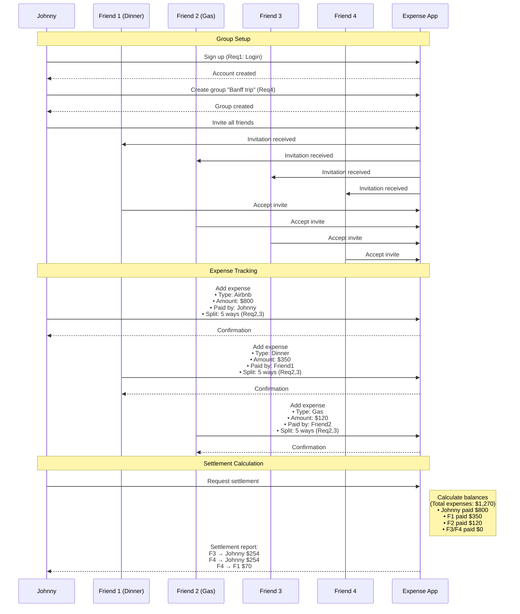

```mermaid
sequenceDiagram
    participant J as Johnny
    participant F1 as Friend 1 (Dinner)
    participant F2 as Friend 2 (Gas)
    participant F3 as Friend 3
    participant F4 as Friend 4
    participant App as Expense App

    Note over J, App: Group Setup

    J->>App: Sign up (Req1: Login)
    App-->>J: Account created

    J->>App: Create group "Banff trip" (Req4)
    App-->>J: Group created

    J->>App: Invite all friends
    App->>F1: Invitation received
    App->>F2: Invitation received
    App->>F3: Invitation received
    App->>F4: Invitation received

    F1->>App: Accept invite
    F2->>App: Accept invite
    F3->>App: Accept invite
    F4->>App: Accept invite

    Note over J, App: Expense Tracking

    J->>App: Add expense<br/>• Type: Airbnb<br/>• Amount: $800<br/>• Paid by: Johnny<br/>• Split: 5 ways (Req2,3)
    App-->>J: Confirmation

    F1->>App: Add expense<br/>• Type: Dinner<br/>• Amount: $350<br/>• Paid by: Friend1<br/>• Split: 5 ways (Req2,3)
    App-->>F1: Confirmation

    F2->>App: Add expense<br/>• Type: Gas<br/>• Amount: $120<br/>• Paid by: Friend2<br/>• Split: 5 ways (Req2,3)
    App-->>F2: Confirmation

    Note over J, App: Settlement Calculation

    J->>App: Request settlement

    Note right of App: Calculate balances<br/>(Total expenses: $1,270)<br/>• Johnny paid $800<br/>• F1 paid $350<br/>• F2 paid $120<br/>• F3/F4 paid $0

    App-->>J: Settlement report:<br/>F3 → Johnny $254<br/>F4 → Johnny $254<br/>F4 → F1 $70
```
