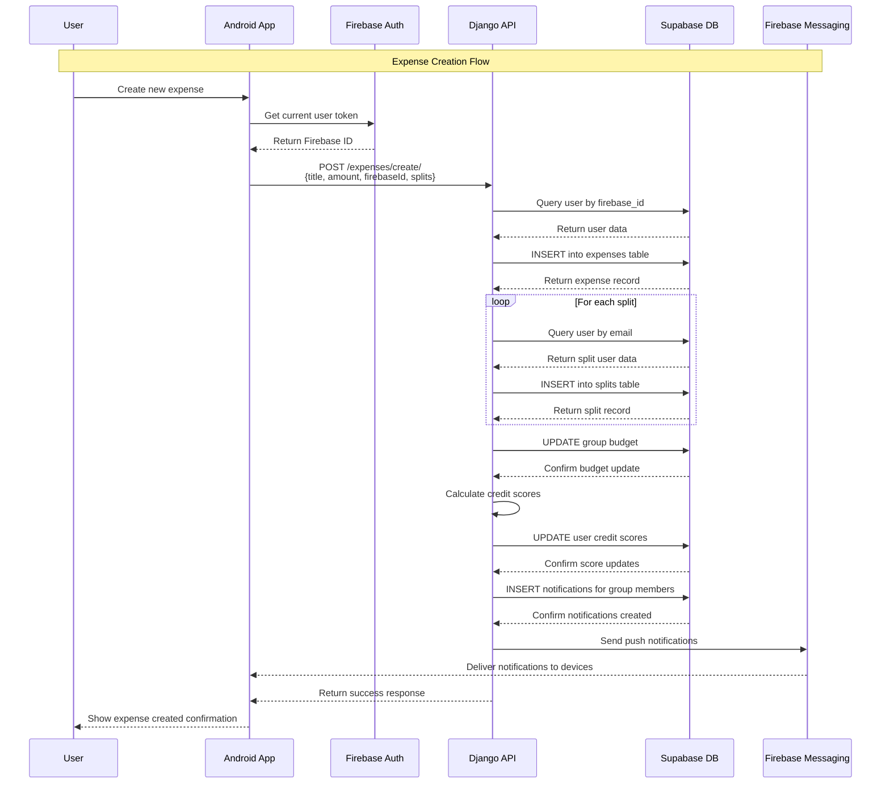

```mermaid
sequenceDiagram
    participant U as User
    participant A as Android App
    participant FA as Firebase Auth
    participant API as Django API
    participant SB as Supabase DB
    participant FCM as Firebase Messaging

    Note over U,FCM: Expense Creation Flow

    U->>A: Create new expense
    A->>FA: Get current user token
    FA-->>A: Return Firebase ID

    A->>API: POST /expenses/create/<br/>{title, amount, firebaseId, splits}
    API->>SB: Query user by firebase_id
    SB-->>API: Return user data

    API->>SB: INSERT into expenses table
    SB-->>API: Return expense record

    loop For each split
        API->>SB: Query user by email
        SB-->>API: Return split user data
        API->>SB: INSERT into splits table
        SB-->>API: Return split record
    end

    API->>SB: UPDATE group budget
    SB-->>API: Confirm budget update

    API->>API: Calculate credit scores
    API->>SB: UPDATE user credit scores
    SB-->>API: Confirm score updates

    API->>SB: INSERT notifications for group members
    SB-->>API: Confirm notifications created

    API->>FCM: Send push notifications
    FCM-->>A: Deliver notifications to devices

    API-->>A: Return success response
    A-->>U: Show expense created confirmation
```
