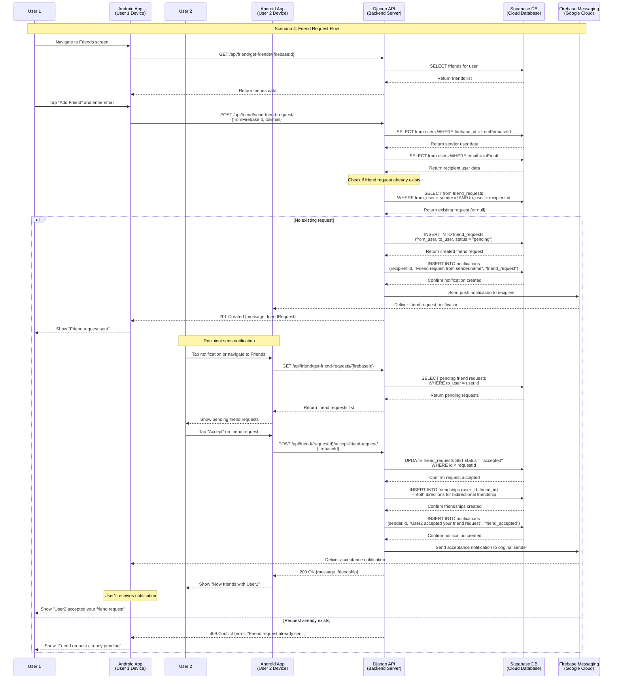

```mermaid
sequenceDiagram
    participant U1 as User 1
    participant A1 as Android App<br/>(User 1 Device)
    participant U2 as User 2
    participant A2 as Android App<br/>(User 2 Device)
    participant API as Django API<br/>(Backend Server)
    participant SB as Supabase DB<br/>(Cloud Database)
    participant FCM as Firebase Messaging<br/>(Google Cloud)

    Note over U1,FCM: Scenario 4: Friend Request Flow

    U1->>A1: Navigate to Friends screen
    A1->>API: GET /api/friend/get-friends/{firebaseId}
    API->>SB: SELECT friends for user
    SB-->>API: Return friends list
    API-->>A1: Return friends data

    U1->>A1: Tap "Add Friend" and enter email
    A1->>API: POST /api/friend/send-friend-request/<br/>{fromFirebaseId, toEmail}

    API->>SB: SELECT from users WHERE firebase_id = fromFirebaseId
    SB-->>API: Return sender user data

    API->>SB: SELECT from users WHERE email = toEmail
    SB-->>API: Return recipient user data

    Note over API: Check if friend request already exists
    API->>SB: SELECT from friend_requests<br/>WHERE from_user = sender.id AND to_user = recipient.id
    SB-->>API: Return existing request (or null)

    alt No existing request
        API->>SB: INSERT INTO friend_requests<br/>(from_user, to_user, status = "pending")
        SB-->>API: Return created friend request

        API->>SB: INSERT INTO notifications<br/>(recipient.id, "Friend request from sender.name", "friend_request")
        SB-->>API: Confirm notification created

        API->>FCM: Send push notification to recipient
        FCM-->>A2: Deliver friend request notification

        API-->>A1: 201 Created {message, friendRequest}
        A1-->>U1: Show "Friend request sent"

        Note over U2,A2: Recipient sees notification
        U2->>A2: Tap notification or navigate to Friends
        A2->>API: GET /api/friend/get-friend-requests/{firebaseId}
        API->>SB: SELECT pending friend requests<br/>WHERE to_user = user.id
        SB-->>API: Return pending requests
        API-->>A2: Return friend requests list

        A2-->>U2: Show pending friend requests
        U2->>A2: Tap "Accept" on friend request

        A2->>API: POST /api/friend/{requestId}/accept-friend-request/<br/>{firebaseId}
        API->>SB: UPDATE friend_requests SET status = "accepted"<br/>WHERE id = requestId
        SB-->>API: Confirm request accepted

        API->>SB: INSERT INTO friendships (user_id, friend_id)<br/>-- Both directions for bidirectional friendship
        SB-->>API: Confirm friendships created

        API->>SB: INSERT INTO notifications<br/>(sender.id, "User2 accepted your friend request", "friend_accepted")
        SB-->>API: Confirm notification created

        API->>FCM: Send acceptance notification to original sender
        FCM-->>A1: Deliver acceptance notification

        API-->>A2: 200 OK {message, friendship}
        A2-->>U2: Show "Now friends with User1"

        Note over A1: User1 receives notification
        A1-->>U1: Show "User2 accepted your friend request"

    else Request already exists
        API-->>A1: 409 Conflict {error: "Friend request already sent"}
        A1-->>U1: Show "Friend request already pending"
    end
```
