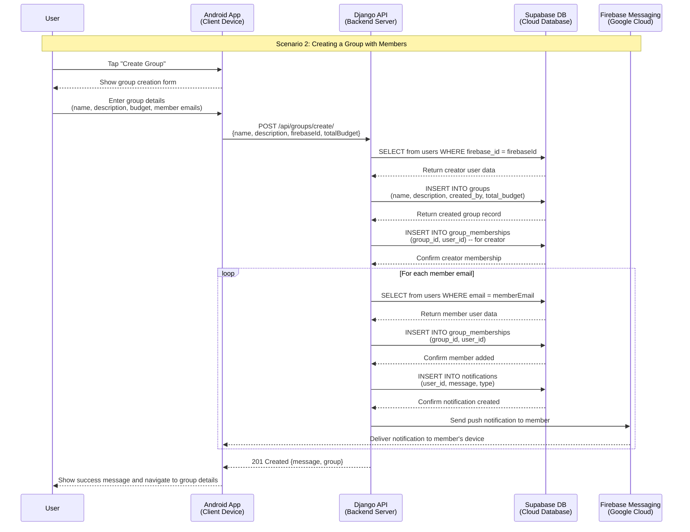

```mermaid
sequenceDiagram
    participant U as User
    participant A as Android App<br/>(Client Device)
    participant API as Django API<br/>(Backend Server)
    participant SB as Supabase DB<br/>(Cloud Database)
    participant FCM as Firebase Messaging<br/>(Google Cloud)

    Note over U,FCM: Scenario 2: Creating a Group with Members

    U->>A: Tap "Create Group"
    A-->>U: Show group creation form

    U->>A: Enter group details<br/>(name, description, budget, member emails)
    A->>API: POST /api/groups/create/<br/>{name, description, firebaseId, totalBudget}

    API->>SB: SELECT from users WHERE firebase_id = firebaseId
    SB-->>API: Return creator user data

    API->>SB: INSERT INTO groups<br/>(name, description, created_by, total_budget)
    SB-->>API: Return created group record

    API->>SB: INSERT INTO group_memberships<br/>(group_id, user_id) -- for creator
    SB-->>API: Confirm creator membership

    loop For each member email
        API->>SB: SELECT from users WHERE email = memberEmail
        SB-->>API: Return member user data

        API->>SB: INSERT INTO group_memberships<br/>(group_id, user_id)
        SB-->>API: Confirm member added

        API->>SB: INSERT INTO notifications<br/>(user_id, message, type)
        SB-->>API: Confirm notification created

        API->>FCM: Send push notification to member
        FCM-->>A: Deliver notification to member's device
    end

    API-->>A: 201 Created {message, group}
    A-->>U: Show success message and navigate to group details
```
