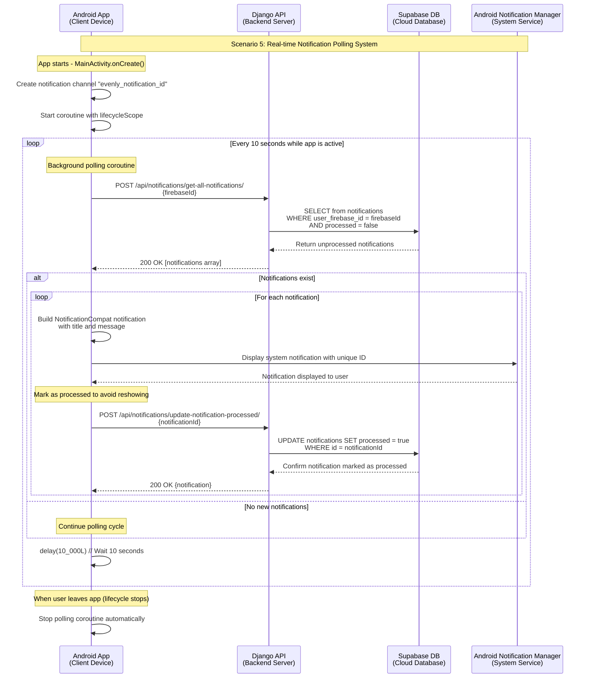

```mermaid
sequenceDiagram
    participant A as Android App<br/>(Client Device)
    participant API as Django API<br/>(Backend Server)
    participant SB as Supabase DB<br/>(Cloud Database)
    participant NM as Android Notification Manager<br/>(System Service)

    Note over A,NM: Scenario 5: Real-time Notification Polling System

    Note over A: App starts - MainActivity.onCreate()
    A->>A: Create notification channel "evenly_notification_id"
    A->>A: Start coroutine with lifecycleScope

    loop Every 10 seconds while app is active
        Note over A: Background polling coroutine
        A->>API: POST /api/notifications/get-all-notifications/<br/>{firebaseId}

        API->>SB: SELECT from notifications<br/>WHERE user_firebase_id = firebaseId<br/>AND processed = false
        SB-->>API: Return unprocessed notifications

        API-->>A: 200 OK [notifications array]

        alt Notifications exist
            loop For each notification
                A->>A: Build NotificationCompat notification<br/>with title and message
                A->>NM: Display system notification with unique ID
                NM-->>A: Notification displayed to user

                Note over A: Mark as processed to avoid reshowing
                A->>API: POST /api/notifications/update-notification-processed/<br/>{notificationId}

                API->>SB: UPDATE notifications SET processed = true<br/>WHERE id = notificationId
                SB-->>API: Confirm notification marked as processed

                API-->>A: 200 OK {notification}
            end
        else No new notifications
            Note over A: Continue polling cycle
        end

        A->>A: delay(10_000L) // Wait 10 seconds
    end

    Note over A: When user leaves app (lifecycle stops)
    A->>A: Stop polling coroutine automatically
```
