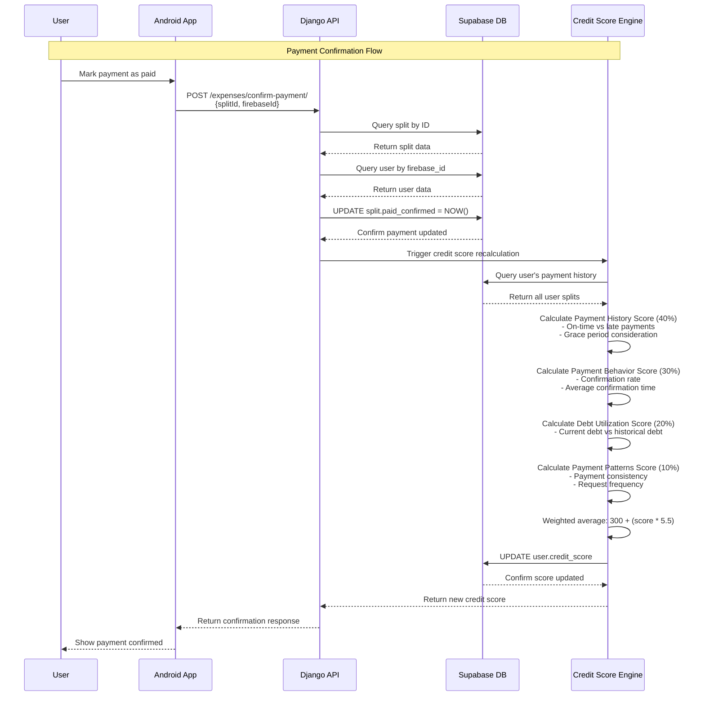

```mermaid
sequenceDiagram
    participant U as User
    participant A as Android App
    participant API as Django API
    participant SB as Supabase DB
    participant CS as Credit Score Engine

    Note over U,CS: Payment Confirmation Flow

    U->>A: Mark payment as paid
    A->>API: POST /expenses/confirm-payment/<br/>{splitId, firebaseId}

    API->>SB: Query split by ID
    SB-->>API: Return split data

    API->>SB: Query user by firebase_id
    SB-->>API: Return user data

    API->>SB: UPDATE split.paid_confirmed = NOW()
    SB-->>API: Confirm payment updated

    API->>CS: Trigger credit score recalculation
    CS->>SB: Query user's payment history
    SB-->>CS: Return all user splits

    CS->>CS: Calculate Payment History Score (40%)<br/>- On-time vs late payments<br/>- Grace period consideration
    CS->>CS: Calculate Payment Behavior Score (30%)<br/>- Confirmation rate<br/>- Average confirmation time
    CS->>CS: Calculate Debt Utilization Score (20%)<br/>- Current debt vs historical debt
    CS->>CS: Calculate Payment Patterns Score (10%)<br/>- Payment consistency<br/>- Request frequency

    CS->>CS: Weighted average: 300 + (score * 5.5)
    CS->>SB: UPDATE user.credit_score
    SB-->>CS: Confirm score updated

    CS-->>API: Return new credit score
    API-->>A: Return confirmation response
    A-->>U: Show payment confirmed
```
