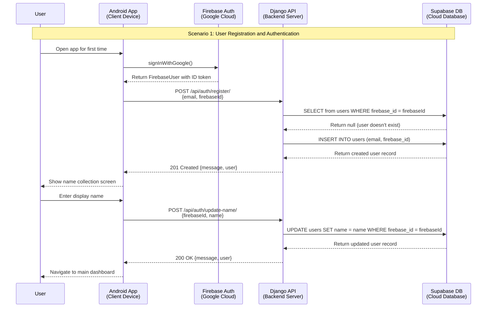

```mermaid
sequenceDiagram
    participant U as User
    participant A as Android App<br/>(Client Device)
    participant FA as Firebase Auth<br/>(Google Cloud)
    participant API as Django API<br/>(Backend Server)
    participant SB as Supabase DB<br/>(Cloud Database)

    Note over U,SB: Scenario 1: User Registration and Authentication

    U->>A: Open app for first time
    A->>FA: signInWithGoogle()
    FA-->>A: Return FirebaseUser with ID token

    A->>API: POST /api/auth/register/<br/>{email, firebaseId}
    API->>SB: SELECT from users WHERE firebase_id = firebaseId
    SB-->>API: Return null (user doesn't exist)

    API->>SB: INSERT INTO users (email, firebase_id)
    SB-->>API: Return created user record

    API-->>A: 201 Created {message, user}
    A-->>U: Show name collection screen

    U->>A: Enter display name
    A->>API: POST /api/auth/update-name/<br/>{firebaseId, name}
    API->>SB: UPDATE users SET name = name WHERE firebase_id = firebaseId
    SB-->>API: Return updated user record

    API-->>A: 200 OK {message, user}
    A-->>U: Navigate to main dashboard
```
